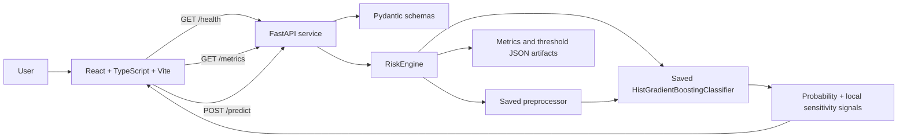
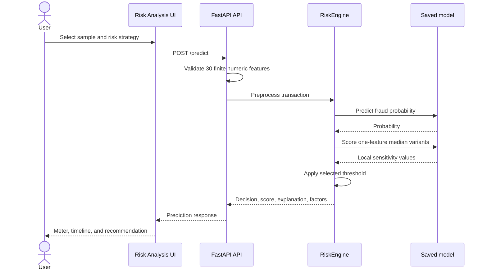

<div align="center">

# SentinelAI

### AI-Powered Transaction Risk Intelligence System

**Analyze transactions. Understand risk. Make clearer payment decisions.**

SentinelAI is an individual full-stack fintech project that converts anonymized transaction signals into configurable fraud-risk probabilities and transparent `APPROVE` or `BLOCK` recommendations.

<p>
  
  
  
  
  
  
</p>

<p>
  <a href="#project-highlights">Highlights</a> ·
  <a href="#architecture">Architecture</a> ·
  <a href="#model-performance">Performance</a> ·
  <a href="#run-locally">Run locally</a>
</p>

</div>

> A professional fintech-style prototype for exploring fraud risk, model performance, explainable decisions, and business-specific risk thresholds.

## Contents

- [Project Highlights](#project-highlights)
- [Overview](#overview)
- [The Problem](#the-problem)
- [Key Features](#key-features)
- [Architecture](#architecture)
- [Frontend Pages](#frontend-pages)
- [Machine Learning and Risk Analysis](#machine-learning-and-risk-analysis)
- [API Reference](#api-reference)
- [Model Performance](#model-performance)
- [Run Locally](#run-locally)
- [Example Workflow](#example-workflow)
- [Product Preview](#product-preview)
- [Project Structure](#project-structure)
- [Limitations](#limitations)
- [Future Improvements](#future-improvements)

## Project Highlights

| Highlight | What it demonstrates |
| --- | --- |
| 🤖 **Real ML-backed predictions** | A saved `HistGradientBoostingClassifier` scores validated transaction features. |
| ⚡ **FastAPI backend** | A focused service exposes health, metrics, and prediction endpoints. |
| 🧭 **React + TypeScript frontend** | A responsive, routed interface presents model output as an analyst-friendly workflow. |
| 🔎 **Local sensitivity signals** | The API compares one-feature-at-a-time train-median variants to provide honest decision context. |
| 🎚️ **Configurable thresholds** | Fraud Protection, Balanced, and Customer Friendly strategies map probability to action. |
| 📱 **Responsive product experience** | Mobile navigation, touch-friendly controls, loading states, error states, and reduced-motion support are included. |

## Overview

Fraud detection has two competing costs: missing fraudulent activity and unnecessarily blocking legitimate customers. SentinelAI demonstrates how a saved classifier and explicit business thresholds can work together to turn complex model output into a clear next action.

The application allows a user to:

- Select an anonymized transaction sample.
- Choose a risk strategy.
- Submit the transaction to the trained model.
- Review the probability, score, threshold, and `APPROVE`/`BLOCK` decision.
- Inspect local sensitivity signals and the decision timeline.
- Review recent analyses stored in the current browser.

SentinelAI is an **individual project** and a demonstration system, not a production payment processor or a claim of production deployment.

## The Problem

Different payment contexts require different risk postures:

- A high-security workflow may prefer detecting more potential fraud.
- A customer-continuity workflow may prefer fewer unnecessary blocks.
- An analyst needs both the model score and the business rule that turned it into an action.

SentinelAI addresses this with a saved fraud classifier, configurable decision thresholds, held-out evaluation reporting, and a transparent presentation of each prediction.

## Key Features

### Transaction risk analysis

| Capability | Description |
| --- | --- |
| **Sample analysis** | Three fixed anonymized samples represent low-risk, suspicious, and high-risk scenarios. |
| **Risk meter** | Shows the real fraud probability against Safe, Moderate, and High Risk bands. |
| **Decision flow** | Presents staged processing from transaction selection through final recommendation. |
| **Decision timeline** | Shows validation, probability calculation, threshold application, and recommendation issuance. |
| **Recent analyses** | Keeps up to five completed analyses in browser `localStorage`, clearly labeled as browser-local history. |

### Explainable decision support

- Displays probability, normalized risk score, selected strategy, threshold, and decision logic.
- Returns the three strongest local sensitivity signals for the current transaction.
- Compares each signal with its train-set median baseline.
- Explicitly labels the signals as local sensitivity, not causal attribution or SHAP explanations.

### Model intelligence

- Loads real held-out precision, recall, F1, PR-AUC, and ROC-AUC values from the backend.
- Compares the configured `0.30`, `0.70`, and `0.90` operating points.
- Verifies API, model, and evaluation-data status on the home page.
- Preserves the trained model, preprocessing pipeline, metrics, and threshold-analysis artifacts.

### Product experience

- Six routed pages with shared navigation, branding, and footer components.
- Responsive desktop and mobile layouts.
- Keyboard focus states and Escape-key support for the mobile menu.
- Loading, empty, error, and successful-result states.
- `prefers-reduced-motion` support.

## Architecture

### Overall system architecture



The frontend uses lightweight client-side routing through the browser History API. The backend loads model artifacts at startup and validates that the saved preprocessor feature order matches the API schema before serving predictions.

### Transaction analysis workflow



## Frontend Pages

| Route | Page | Purpose |
| --- | --- | --- |
| `/` | Home | Introduces SentinelAI, provides primary actions, and displays verified API/model/evaluation status. |
| `/risk-analysis` | Risk Analysis | Runs a transaction through the model and displays the decision, risk meter, local sensitivity signals, processing sequence, timeline, and browser-local history. |
| `/how-it-works` | How It Works | Explains the five conceptual stages from transaction data to a clear decision. |
| `/performance` | Model Performance | Loads real held-out evaluation metrics and compares configured risk thresholds. |
| `/risk-strategies` | Risk Strategies | Explains and compares the three business risk postures. |
| `/about` | About | Documents the practical technology stack and project approach. |

## Machine Learning and Risk Analysis

### Data preparation

The preprocessing workflow reads `ml/data/raw/creditcard.csv`, validates the numeric features and binary `Class` target, then creates a stratified 80/20 train/test split. The preprocessor is fit on training data only and saved to `ml/models/preprocessor.joblib`.

<details>
<summary>Dataset details</summary>

- Total rows: `284,807`
- Training rows: `227,845`
- Held-out test rows: `56,962`
- Fraud examples in the full dataset: `492`
- Random seed: `42`
- Input features: `Time`, `V1` through `V28`, and `Amount`
- Missing feature values: `0`
- Preprocessing: median imputation followed by `RobustScaler`

</details>

### Model selection

The training workflow compares a balanced `LogisticRegression` baseline with a weighted `HistGradientBoostingClassifier`. PR-AUC is the primary selection criterion and F1 score is the tie-breaker. The current saved model is `hist_gradient_boosting`.

### Risk strategies

| Strategy | Threshold | Intended posture |
| --- | ---: | --- |
| 🛡️ **Fraud Protection** | `0.30` | Lower threshold and higher detection sensitivity. |
| ⚖️ **Balanced** | `0.70` | Middle operating point balancing detection and unnecessary blocks. |
| 😊 **Customer Friendly** | `0.90` | Higher threshold intended to reduce unnecessary blocks. |

The API returns `BLOCK` when `fraud_probability >= threshold`; otherwise it returns `APPROVE`.

### Local sensitivity signals

The backend creates local decision context by replacing one input feature at a time with its train-set median, scoring those variants in a batch, and ranking the largest probability changes. This is an intentionally transparent sensitivity method. It is **not** SHAP, causal inference, or a claim that a feature independently caused the decision.

## API Reference

The backend runs by default at `http://localhost:8000`.

| Method | Endpoint | Purpose |
| --- | --- | --- |
| `GET` | `/health` | Reports service availability. |
| `GET` | `/metrics` | Returns persisted held-out evaluation metrics. |
| `POST` | `/predict` | Validates and scores one transaction. |

### `GET /health`

```json
{
  "status": "ok",
  "service": "SentinelAI Risk Engine"
}
```

### `GET /metrics`

Returns the contents of `ml/models/test_metrics.json`, including precision, recall, F1 score, PR-AUC, ROC-AUC, confusion matrix values, test-set size, and positive test examples.

### `POST /predict`

The request contains a `transaction` object with the 30 features `Time`, `V1` through `V28`, and `Amount`, plus one of the valid modes: `fraud_protection`, `balanced`, or `customer_friendly`.

<details>
<summary>Full request example</summary>

```json
{
  "transaction": {
    "Time": 70281,
    "V1": -0.0499974737,
    "V2": 2.3538885324,
    "V3": -2.8342752785,
    "V4": 1.5894979847,
    "V5": 0.5127687058,
    "V6": -1.7215694164,
    "V7": 0.2041802038,
    "V8": 0.6243971903,
    "V9": -0.4327469485,
    "V10": -1.3211802717,
    "V11": -0.0292813264,
    "V12": -0.5741826728,
    "V13": -0.1547527815,
    "V14": -2.959731791,
    "V15": 1.0745367978,
    "V16": 1.2129659535,
    "V17": 2.9823417602,
    "V18": 1.7575614597,
    "V19": -0.2629057009,
    "V20": 0.0077845739,
    "V21": -0.1278389002,
    "V22": -0.3156699944,
    "V23": 0.1422016098,
    "V24": -0.4719942189,
    "V25": -0.3005852615,
    "V26": -0.3600497469,
    "V27": 0.1101939874,
    "V28": -0.0546565143,
    "Amount": 1.29
  },
  "risk_mode": "balanced"
}
```

</details>

The response includes `fraud_probability`, `risk_score`, `risk_mode`, `threshold_used`, `decision`, `explanation`, and three `risk_factors`. Each factor includes the feature name, observed value, train-median baseline, impact, and direction.

## Model Performance

These are the real values persisted in `ml/models/test_metrics.json`, measured on the held-out test split at the evaluation script's `0.50` threshold.

| Metric | Held-out value |
| --- | ---: |
| **Precision** | **0.2973** (`29.73%`) |
| **Recall** | **0.8980** (`89.80%`) |
| **F1 score** | **0.4467** |
| **PR-AUC / Average Precision** | **0.7204** |
| **ROC-AUC** | **0.9623** |
| Test samples | `56,962` |
| Positive test samples | `98` |

### Confusion matrix at `0.50`

|  | Predicted legitimate | Predicted fraud |
| --- | ---: | ---: |
| **Actual legitimate** | `56,656` true negatives | `208` false positives |
| **Actual fraud** | `10` false negatives | `88` true positives |

Threshold analysis is persisted in `ml/models/threshold_analysis.json`. On the held-out test split, the evaluated `0.90` threshold produced the highest F1 score among the listed thresholds (`0.6835`), while `0.30` produced the highest recall (`0.9184`). These are evaluation findings, not production calibration claims.

## Run Locally

### Prerequisites

- Python 3.10+ recommended
- Node.js and npm
- An environment capable of running FastAPI and Vite

### 1. Clone the repository

```bash
git clone <your-repository-url>
cd "Sentinel Ai"
```

### 2. Create the Python environment

From the repository root:

```bash
python -m venv .venv
```

Windows PowerShell:

```powershell
.\.venv\Scripts\Activate.ps1
```

macOS/Linux:

```bash
source .venv/bin/activate
```

Install backend dependencies:

```bash
python -m pip install --upgrade pip
python -m pip install -r requirements.txt
```

### 3. Install frontend dependencies

```bash
cd frontend
npm install
cd ..
```

The frontend defaults to `http://localhost:8000` for the API. To use another backend URL:

```powershell
$env:VITE_API_BASE_URL = "http://127.0.0.1:8000"
```

### 4. Start the backend

Run from the repository root:

```bash
python -m uvicorn backend.app.main:app --reload --port 8000
```

The API is available at `http://localhost:8000`. Interactive FastAPI documentation is available at `http://localhost:8000/docs`.

### 5. Start the frontend

In a second terminal:

```bash
cd frontend
npm run dev
```

Open the Vite URL shown in the terminal, normally `http://localhost:5173`.

### Production frontend build

```bash
cd frontend
npm run build
```

This runs TypeScript project compilation followed by `vite build`.

### Rebuild ML artifacts

The saved artifacts are already included. To reproduce preprocessing, training, and evaluation from the repository root:

```bash
python ml/src/preprocess.py
python ml/src/train.py
python ml/src/evaluate.py
```

Run the scripts in that order. They write processed arrays and JSON/joblib outputs under `ml/data/processed/` and `ml/models/`.

## Example Workflow

1. Start the backend and frontend.
2. Open **Risk Analysis**.
3. Select **Low Risk**, **Suspicious**, or **High Risk**.
4. Choose **Fraud Protection**, **Balanced**, or **Customer Friendly**.
5. Select **Analyze Transaction**.
6. Watch the staged processing sequence advance.
7. Review probability, risk score, threshold, and `APPROVE`/`BLOCK` decision.
8. Inspect local sensitivity signals and the decision timeline.
9. Review the result under **Recent analyses**. This history is stored only in the current browser and can be cleared.

## Product Preview

Screenshots are not currently included in the repository. The following references are prepared as placeholders for portfolio captures:

<div align="center">

| Home | Risk analysis | Model performance |
| --- | --- | --- |
| `docs/screenshots/home.png` | `docs/screenshots/risk-analysis.png` | `docs/screenshots/performance.png` |

</div>

After capturing the screens, place the files under `docs/screenshots/` and replace the table with image previews such as:

```markdown

```

Recommended captures include the verified home status strip, an `APPROVE` analysis, a `BLOCK` analysis, and the held-out performance page.

## Project Structure

```text
Sentinel Ai/
├── README.md
├── requirements.txt
├── backend/
│   └── app/
│       ├── main.py                 # FastAPI app and API routes
│       ├── schemas.py              # Request/response validation models
│       └── services/
│           └── risk_engine.py      # Artifact loading, prediction, sensitivity signals
├── frontend/
│   ├── index.html
│   ├── package.json
│   ├── tsconfig*.json
│   ├── vite.config.ts
│   └── src/
│       ├── api.ts                  # API base URL and system status calls
│       ├── App.tsx                 # Client-side route selection and app shell
│       ├── demoTransactions.ts     # Anonymized demo transaction payloads
│       ├── siteData.ts              # Navigation, strategies, formatting helpers
│       ├── styles.css               # Shared responsive design system
│       ├── components/              # Navbar, footer, and logo components
│       └── pages/                   # Home, analysis, performance, and content pages
└── ml/
    ├── data/
    │   ├── raw/creditcard.csv
    │   └── processed/              # Generated train/test arrays and summary
    ├── models/                     # Saved model, preprocessor, metrics, analyses
    └── src/
        ├── preprocess.py
        ├── train.py
        └── evaluate.py
```

## Limitations

<details>
<summary>Current limitations and scope boundaries</summary>

- The project uses anonymized `V1` through `V28` features, so displayed signals are not human-readable business attributes.
- The dataset is highly imbalanced, and held-out precision at the evaluation threshold is lower than recall.
- The API returns local one-feature sensitivity signals, not SHAP values, causal explanations, or calibrated feature attribution.
- Demo transactions are fixed samples; there is no production transaction-ingestion pipeline.
- Recent analysis history is stored in browser `localStorage`, not a user account or shared database.
- There is no authentication, authorization, analyst audit trail, rate limiting, or persistent multi-user storage.
- The frontend uses lightweight client-side routing and is not configured with a production server fallback in this repository.
- No automated frontend or backend test suite is currently included.
- Saved model artifacts must remain compatible with the checked-in schema and preprocessing pipeline.

</details>

## Future Improvements

- Add automated backend API tests and browser-level frontend tests.
- Add authentication, analyst roles, and server-side analysis history.
- Add production database storage and audit events for decisions.
- Calibrate probabilities and evaluate threshold performance on refreshed data.
- Add model monitoring for drift, precision, recall, and alert volume.
- Investigate SHAP or another validated explainability method for the selected estimator.
- Add production deployment configuration with environment-specific CORS and API URLs.
- Add screenshot assets, CI checks, and deployment documentation for portfolio presentation.

## Individual Project

SentinelAI is developed and presented as an **individual project**. It demonstrates full-stack integration across a React frontend, FastAPI backend, saved machine-learning artifacts, configurable fraud-risk strategies, local sensitivity signals, and model evaluation reporting.
